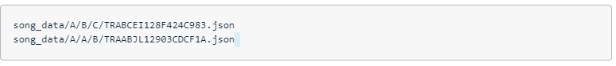
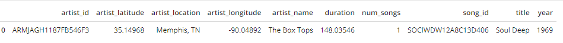
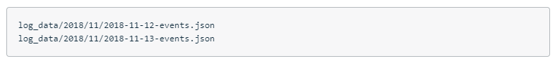
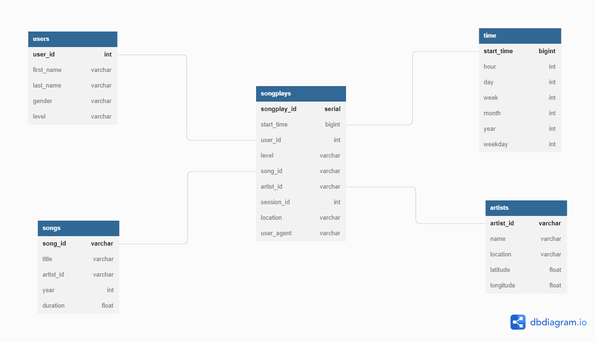
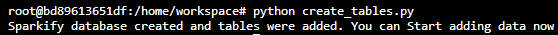
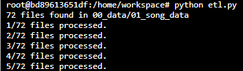
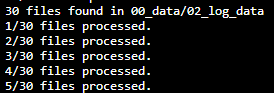

# Data modeling with Postgres

## Project Scenario

A startup called **Sparkify** wants to analyze the data they've been collecting on songs and user activity on their new **music streaming app**. The analytics team is particularly interested in understanding what songs users are listening to. Currently, they don't have an easy way to query their data, which resides in a directory of **JSON logs** on user activity on the app, as well as a directory with **JSON metadata** on the songs in their app.

They'd like a **data engineer** to create a **Postgres database** with tables designed to optimize queries on song play analysis, and bring you on the project. My role is to create a database schema and ETL pipeline for this analysis. Test the database and ETL pipeline by running queries given to you by the analytics team from **Sparkify** and compare your results with their expected results.

## Project Task Description

**ROLE:** *Data Engineer*

**Author:** *Ashish Soni*

Define fact and dimension tables for a star schema for a particular analytic focus. The task is to build an ETL pipeline using Python and SQL that transfers data from files in two local directories into the tables in Postgres.


## Data

1. **Song Dataset**
The first dataset is a subset of real data from the Million Song Dataset. Each file is in **JSON** format and contains metadata about a song and the artist of that song. The files are partitioned by the first three letters of each song's track ID.



**Example data:**


2. **Log Dataset**
The second dataset consists of log files in **JSON** format generated by this event simulator based on the songs in the dataset above. These simulate activity logs from a music streaming app based on specified configurations.
The log files in the dataset you'll be working with are partitioned by year and month.



**Example data:**


## Data Model

Using the song and log datasets, you'll need to create a star schema optimized for queries on song play analysis. This includes the following tables.

### Fact Table

1. songplays -> records in log data associated with song plays i.e.

- records with page NextSong
- songplay_id
- start_time
- user_id
- level
- song_id
- artist_id
- session_id
- location
- user_agent

### Dimension Tables

2. users -> users in the app

- user_id
- first_name
- last_name
- gender
- level

3. songs -> songs in music database

- song_id
- title
- artist_id
- year
- duration

4. artists -> artists in music database

- artist_id
- name
- location
- latitude
- longitude

5. time -> timestamps of records in songplays broken down into specific units

- start_time
- hour
- day
- week
- month
- year
- weekday

## Schema and ERD Diagram



## Usage/Examples

To run the ETL Pipeline, run the following scripts in a sequential manner.

```bash

# Creates the database and tables
python create_tables.py

```

**Example**



```bash

# Transforms the data and then loads it into the respective tables in the database
python etl.py

```

**Example**





## Tech Stack

**Programming Language**: *Python*

**Data Storage and Querying**: *PostgresSQL*
